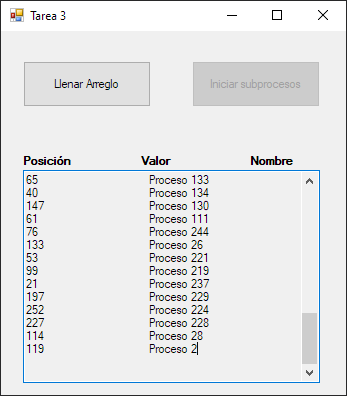

# Programa que genera números aleatorios por medio del uso de hilos.

El programa genera un arreglo de números aleatorios y luego los muestra gráficamente por medio del uso de hilos.

* Hay que arreglar la forma en que se muestra la información.
